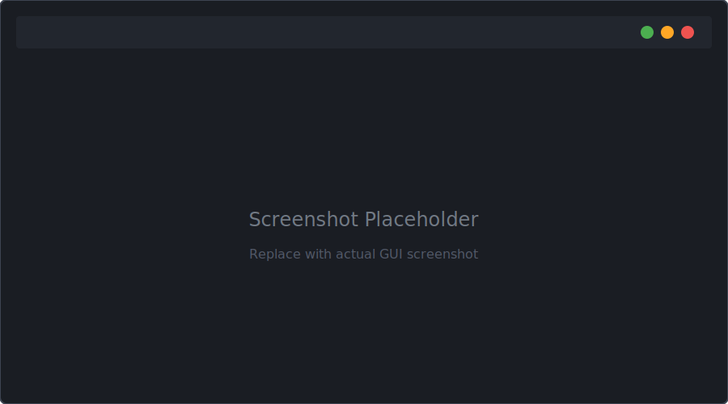

<div class="hero">
  <div class="hero-logos">
    
    <span class="hero-logo-divider">&times;</span>
    
  </div>
  <h1>Anametric <strong>STEER</strong></h1>
  <p class="subtitle">Statistical Testing of Entropy Evaluation Report</p>
  <p class="subtitle" style="font-size:0.85rem; margin-top:4px; color:var(--text-muted);">
    Rigorous statistical &amp; causal evaluation of random number generators and entropy sources.
  </p>
  <div class="hero-links">
    <a href="#getting-started" class="btn-primary">Get Started</a>
    <a href="STEER_GUI_User_Guide" class="btn-outline">GUI Guide</a>
    <a href="https://github.com/mathornton01/steer-framework" class="btn-outline" target="_blank">GitHub &nearr;</a>
  </div>
</div>

<div class="stats-bar">
  <div class="stat-item">
    <span class="stat-number">76</span>
    <span class="stat-label">Statistical Tests</span>
  </div>
  <div class="stat-item">
    <span class="stat-number">4</span>
    <span class="stat-label">Test Batteries</span>
  </div>
  <div class="stat-item">
    <span class="stat-number">2</span>
    <span class="stat-label">Causal Models</span>
  </div>
  <div class="stat-item">
    <span class="stat-number">3</span>
    <span class="stat-label">Platforms</span>
  </div>
</div>

<div class="video-placeholder">
  <div class="video-placeholder-inner">
    <div class="video-play-icon">&#9654;</div>
    <p class="video-placeholder-title">Demo Video</p>
    <p class="video-placeholder-sub">Coming soon — a walkthrough of the Anametric STEER GUI and test workflow.</p>
  </div>
</div>

---

<div class="battery-grid">
  <div class="battery-card">
    <h4>NIST STS</h4>
    <p><span class="count">15</span> tests</p>
    <p>SP 800-22 Rev 1a — the worldwide standard for RNG certification.</p>
  </div>
  <div class="battery-card">
    <h4>Diehard</h4>
    <p><span class="count">28</span> tests</p>
    <p>Marsaglia, Bauer, and Brown battery suites.</p>
  </div>
  <div class="battery-card">
    <h4>TestU01</h4>
    <p><span class="count">31</span> tests</p>
    <p>L'Ecuyer's stringent test library.</p>
  </div>
  <div class="battery-card featured">
    <h4>Causal Models</h4>
    <p><span class="count">2</span> tests</p>
    <p>Pearl &amp; Rubin causal inference — <em>Anametric innovation.</em></p>
  </div>
</div>

<div class="causal-highlight">
  <h3><span class="badge">New</span> Causal Inference Test Battery</h3>
  <p>
    <strong>Pearl Causal Model (PCM)</strong> — Structural causal modeling detects directional dependencies in bitstreams that violate randomness assumptions.
  </p>
  <p>
    <strong>Rubin Causal Model (RCM)</strong> — Potential outcomes framework identifies treatment-effect-like deviations across bitstream subpopulations.
  </p>
  <p style="margin-top:12px; font-size:0.82rem; color:var(--text-muted);">
    These tests detect failure modes that purely statistical batteries may miss.
  </p>
</div>

---

<div class="carousel-section">

<h2>GUI Application</h2>

<p class="section-subtitle">Select tests, configure parameters, execute runs, and review results — all from a modern graphical interface.</p>

<div class="carousel-wrapper">
  <button class="carousel-arrow prev" aria-label="Previous">&lsaquo;</button>
  <div class="carousel-viewport">
    <div class="carousel-track">
      <div class="carousel-slide">
        
      </div>
      <div class="carousel-slide">
        
      </div>
      <div class="carousel-slide">
        
      </div>
      <div class="carousel-slide">
        
      </div>
      <div class="carousel-slide">
        
      </div>
      <div class="carousel-slide">
        
      </div>
      <div class="carousel-slide">
        
      </div>
    </div>
  </div>
  <button class="carousel-arrow next" aria-label="Next">&rsaquo;</button>

  <!-- Reflection layers (one per slide, toggled by JS) -->
  <div class="carousel-reflection"></div>
  <div class="carousel-reflection" style="display:none"></div>
  <div class="carousel-reflection" style="display:none"></div>
  <div class="carousel-reflection" style="display:none"></div>
  <div class="carousel-reflection" style="display:none"></div>
  <div class="carousel-reflection" style="display:none"></div>
  <div class="carousel-reflection" style="display:none"></div>

  <!-- Captions (one per slide, toggled by JS) -->
  <div class="carousel-caption"><h4>Main Window</h4><p>Three-panel layout with test browser, parameters, and results.</p></div>
  <div class="carousel-caption" style="display:none"><h4>Test Selection</h4><p>Browse all 76 tests across NIST STS, Diehard, TestU01, and Causal batteries.</p></div>
  <div class="carousel-caption" style="display:none"><h4>Parameter Configuration</h4><p>Common settings and test-specific parameters like block size, dimensions, and significance level.</p></div>
  <div class="carousel-caption" style="display:none"><h4>Test Execution</h4><p>Real-time progress tracking with live output streaming.</p></div>
  <div class="carousel-caption" style="display:none"><h4>Results Summary</h4><p>Pass/fail evaluation with probability values at a glance.</p></div>
  <div class="carousel-caption" style="display:none"><h4>Results Details</h4><p>Hierarchical breakdown of configurations, calculations, and evaluation criteria.</p></div>
  <div class="carousel-caption" style="display:none"><h4>Documentation Browser</h4><p>Mathematical basis, parameter descriptions, and usage guidance for every test.</p></div>

  <div class="carousel-dots">
    <button class="carousel-dot active" aria-label="Slide 1"></button>
    <button class="carousel-dot" aria-label="Slide 2"></button>
    <button class="carousel-dot" aria-label="Slide 3"></button>
    <button class="carousel-dot" aria-label="Slide 4"></button>
    <button class="carousel-dot" aria-label="Slide 5"></button>
    <button class="carousel-dot" aria-label="Slide 6"></button>
    <button class="carousel-dot" aria-label="Slide 7"></button>
  </div>
</div>

</div>

---

<div class="feature-grid">
  <div class="feature-item">
    <span class="feature-icon">&#9881;</span>
    <div>
      <h4>CLI &amp; GUI</h4>
      <p>Full command-line interface with JSON scheduling plus a PyQt6 desktop application.</p>
    </div>
  </div>
  <div class="feature-item">
    <span class="feature-icon">&#9733;</span>
    <div>
      <h4>76 Tests, 4 Batteries</h4>
      <p>NIST STS, Diehard/Dieharder, TestU01 Crush, and causal inference models.</p>
    </div>
  </div>
  <div class="feature-item">
    <span class="feature-icon">&#128202;</span>
    <div>
      <h4>Structured Reporting</h4>
      <p>JSON reports with hierarchical detail, summary views, and syntax-highlighted output.</p>
    </div>
  </div>
  <div class="feature-item">
    <span class="feature-icon">&#128736;</span>
    <div>
      <h4>Cross-Platform</h4>
      <p>Windows, Linux, and macOS with platform-specific installers and build scripts.</p>
    </div>
  </div>
</div>

---

## Test Batteries

### NIST Statistical Test Suite (15 tests)

The foundational battery from [NIST SP 800-22](https://csrc.nist.gov/publications/detail/sp/800-22/rev-1a/final):

- Frequency (Monobit), Block Frequency, Runs, Longest Run of Ones
- Rank, Discrete Fourier Transform, Non-overlapping Template Matching
- Overlapping Template Matching, Universal Statistical, Linear Complexity
- Serial, Approximate Entropy, Cumulative Sums
- Random Excursions, Random Excursions Variant

### Diehard / Dieharder Battery (28 tests)

Marsaglia's original Diehard tests plus extensions by Bauer (DAB) and Brown (RGB):

- **Marsaglia:** Birthday Spacings, Parking Lot, Minimum Distance, Squeeze, Overlapping Permutations, Rank 32x32, Rank 6x8, Bitstream, OPSO, OQSO, DNA, Count 1s, 3D Sphere, Sums, Runs, Craps, GCD
- **DAB:** Bytedistrib, DCT, Filltree, Filltree2, Monobit2
- **RGB:** Bitdist, Minimum Distance, Permutations, Lagged Sum, KS Test

### TestU01 Crush Battery (31 tests)

L'Ecuyer's TestU01 library — among the most stringent suites available:

Serial Over, Close Pairs, Collision Over, GCD, Linear Complexity, Appearance Spacings, Sum Collector, Savir2, Coupon Collector, Weight Distribution, Close Pairs Bit Match, Simplified Poker, Gap, Collision Permut, Max of T, Run, Permutation, Sample Product, Sample Mean, Sample Correlation, Random Walk, Hamming, String Run, Autocorrelation, Periods in Strings, Longest Head Run, Fourier Spectral, Entropy Discretization, Multinomial Bits Over

### Causal Model Tests (2 tests) — <em style="color:var(--accent-gold);">Anametric Innovation</em>

- **Pearl Causal Model (PCM)** — Structural causal modeling to detect directional dependencies
- **Rubin Causal Model (RCM)** — Potential outcomes framework to identify treatment-effect-like deviations

---

## Getting Started

### Quick Install

**Windows:**
```cmd
cd steer-framework\installers
install_windows.bat
```

**Linux / macOS:**
```bash
cd steer-framework/installers
bash install_linux.sh   # or install_macos.sh
```

### Build from Source

```bash
git clone https://github.com/mathornton01/steer-framework.git
cd steer-framework
bash build.sh
```

### Launch the GUI

```bash
python src/steer-gui/main.py
```

### Run Tests via CLI

```bash
./bin/linux/x64/Debug/nist_sts_frequency_test \
  -l full -e data/random.bin \
  -p test/validation/nist-sts/frequency/parameters_pi.json \
  -r results/frequency_report.json -R
```

---

## Architecture

```
steer-framework/
├── src/
│   ├── nist-sts/       # 15 NIST STS tests (C)
│   ├── diehard/        # 28 Diehard tests (C)
│   ├── testu01/        # 31 TestU01 tests (C)
│   ├── python-tests/   # Causal model tests (Python)
│   └── steer-gui/      # PyQt6 application
├── include/            # STEER C library headers
├── docs/               # Guides & documentation
├── installers/         # Platform installers
└── sdk/python/         # Python SDK
```

---

## Documentation

- **[CLI User Guide](STEER_User_Guide)** — Command-line tools, build system, test scheduling, and validation
- **[GUI User Guide](STEER_GUI_User_Guide)** — Graphical application walkthrough with all features
- **[Developer Guide](STEER_Developer_Guide)** — Adding custom tests, framework internals, and API reference

---

## Platform Support

| Platform | CLI Tests | GUI | Installer |
|----------|-----------|-----|-----------|
| **Linux** (x64, arm64) | Native | Native | `install_linux.sh` |
| **macOS** (x64, arm64) | Native | Native | `install_macos.sh` |
| **Windows** (x64) | Via WSL | Native | `install_windows.bat` |

---

## Credits

Anametric STEER builds on foundational work by:

- **NIST** — Statistical Test Suite (SP 800-22 Rev 1a)
- **George Marsaglia** — Diehard Battery of Tests of Randomness
- **Robert G. Brown** — Dieharder: A Random Number Test Suite (RGB tests)
- **David Bauer** — Dieharder DAB test extensions
- **Pierre L'Ecuyer & Richard Simard** — TestU01 statistical testing library
